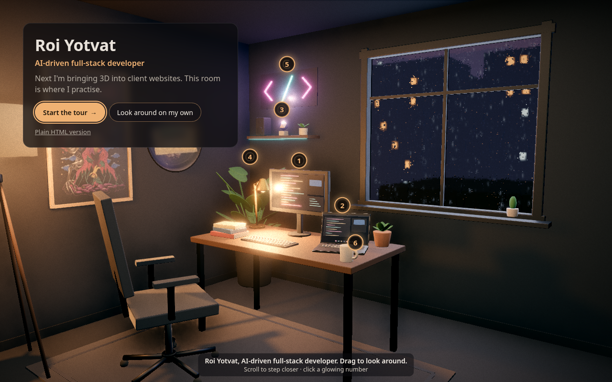

# desk-3d

Roi Yotvat's 3D portfolio: a cozy, rainy evening room you can walk through in the browser.
Built with React, Vite, react-three-fiber, drei and @react-three/postprocessing.

**Live:** https://roiyot26.github.io/desk-3d/ · **Plain version:** https://roiyot26.github.io/desk-3d/?view=list



## Portfolio interactions

- **Tour.** The cold open has **Start the tour**. There are six numbered, glowing markers: 1 desk/monitor (who I am + projects carousel), 2 laptop (3D for the web), 3 bookshelf (stack), 4 terrarium (Virtual Garden), 5 cork board (career path), 6 mug (contact). Next/Back and ←/→ move between stops. The camera eases to each stop and opens one panel. **Free roam**, Escape, the × button or a click on the room closes the panel and returns the camera. A progress row of 6 dots tracks visited stops, with a 7th ★ for hidden bonus objects (rubber duck, art pieces). Visited markers dim. Seeing all six shows a small "you've seen the room" card.
- **Click anything registered.** Hovering a target shows a label and a pointer cursor. Keyboard focus works on the markers too. On touch screens the first tap shows the label and a second tap (or **Open**) opens the panel. Phones get a bottom sheet and hard camera cuts follow `prefers-reduced-motion`.
- **Deep links.** `#stop-1` … `#stop-6`, plus aliases `#projects`, `#3d`/`#goal`, `#skills`/`#stack`, `#garden`, `#career`, `#contact`, and `#project-<slug>` / `#skill-<id>`. The hash follows the open panel.
- **Plain version.** `?view=list` renders the same content as a fast, printable HTML page. It is also the automatic fallback when WebGL is missing or fails twice, and a static copy is baked into `<noscript>` at build time for crawlers.
- **First impression.** `public/poster.jpg` (a blurred still, ~35 KB) is painted by `index.html` before any JS runs. A real loader shows bytes downloaded and then shader warm-up, and the poster fades into the canvas once the room has rendered.

### Content: `src/content/content.json`

Every word on the site lives in one file: bio, projects, skills, career, contact, panel copy, hover labels and tour buttons. The 3D panels, the hover labels, the list page and the `<noscript>`/meta tags all read from it. Contact has GitHub and LinkedIn. `contact.email` is a slot that stays hidden until `enabled: true` and an address are set.

### Click targets: the `CLICK_*` convention

In Blender, every interactive object is a top-level **empty named `CLICK_<Thing>`** with its meshes as children. A raycast hit walks up the parents to the nearest registered node. The map lives in `src/targets.ts`:

| Empty | Opens |
| --- | --- |
| `CLICK_Monitor_Projects` | stop 1 (a `ScreenSlot` material under it shows the carousel's project) |
| `CLICK_Laptop_3D`, `CLICK_Frame_3DRender` | stop 2 |
| `CLICK_Bookshelf_Skills`, `CLICK_Book_<React/Next/Node/TS/Mongo/AWS/WordPress-PHP/ClaudeCode>` | stop 3 (a book highlights its skill) |
| `CLICK_Terrarium_VirtualGarden` | stop 4 |
| `CLICK_Chalkboard_Career` / `CLICK_CorkBoard_Career` | stop 5 |
| `CLICK_Mug_Contact` | stop 6 |
| `CLICK_RubberDuck`, `CLICK_Art_Poster`, `CLICK_Art_Pan`, `CLICK_Art_Sculpture` | bonus captions (★) |
| `CLICK_StickyNote_NowBuilding` | "now building" aside |

Missing empties are skipped silently. Until they're exported, each target has a **fallback** regex over the current GLB's mesh names (monitor meshes, the `Laptop` group, the wall shelf, desk books, the floor plant, the neon sign, the mug, the poster, the framed pan, the sculpture). Empties always win over fallbacks. Small objects get an invisible, larger hit box.

### Resilience

- Software GL (SwiftShader, llvmpipe) starts on the **low** tier: no post, no shadows, Lambert materials.
- A shader link failure or a lost WebGL context remounts the room on the low tier. A second failure switches to the plain page.
- **Auto quality.** Under 30 fps for 3 s steps down: post off → rain particles off → DPR 1 (off when `?quality=` forces a tier).
- `three` is aliased to `src/three-shim.ts`, which swaps the deprecated `THREE.Clock` that react-three-fiber v8 creates for a `THREE.Timer`-backed one. Nothing reads pixels back per frame.

## What's in it

- **Interior camera.** Eye height 1.4 m, 26 mm-equivalent lens. A 26 mm full-frame lens has a 69.4° horizontal FOV, so we keep that on landscape screens (about 42–47° vertical `fov` at 16:9–16:10). Portrait screens get up to 72° vertical and their own framing, so the desk and the window both fit. Drag to look around: the room follows the cursor. Scroll to step closer. There is no pan, and the camera is kept inside the walls. When idle it drifts gently instead of spinning.
- **Rain.** The window pane gets a GPU shader with misty glass, beads, and running drops that leave trails. Every frame, the city behind the glass is rendered at half resolution into a mip-mapped target. Mist reads a blurred mip, while drops and trails refract a sharp image. Behind the glass, instanced GPU streaks fall through the city layer. Blender's static rain cards are hidden (`KEEP_GLB_RAIN` in `src/Room.tsx`).
- **Light.** Blender lights aren't exported, so lights are placed from what the model contains: a warm 2700K shadowed spot at the desk-lamp bulb, a warm point light at each other bulb, small neon accents, a cool window fill, and a soft warm ceiling bounce. Shadows are soft PCF and render once (the room is static).
- **Post.** N8AO ambient occlusion, then bloom (HDR above 1.0, so only neon, bulbs and city signs glow), AgX tone mapping, a teal-shadow / warm-highlight split tone, a small saturation and contrast lift, vignette, light film grain, and SMAA.
- **Performance.** DPR is capped at 2 (1.5 below the high tier). Phones and low-power devices get the medium tier: no AO, no grain, no SMAA, cheaper bloom, fewer rain streaks. `prefers-reduced-motion` turns off the drift and the camera eases. Force a tier with `?quality=high|medium|low`.

## Run locally

```bash
npm i
npm run dev
```

## Swapping the model

`public/desk.glb` is a replaceable asset. Drop in a new export with the same name and the page adapts. Mesh names are hints only, and each one has a geometric fallback:

- The room bounds come from wall and floor meshes (they keep the camera inside).
- The window pane is found by name (`glass`/`pane`), a transmission material, or a transparent material. If there's no pane, a rain overlay plane is placed in the `Win*`/`Window*` frame opening.
- Lamps come from emissive `*Bulb*` meshes and neon from emissive `*Neon*`/`*LED*` meshes.
- Anything outside the room (city, sky) is drawn in the window pass behind the glass.
- Baked lighting: `aoMap`/`lightMap` on UV2 are left as exported. When they are present (or with `?baked=1`), the live lights dim to accents and AO post is skipped.

`node scripts/inspect-glb.mjs public/desk.glb` prints the nodes, materials and bounds of a GLB.

## License

MIT
